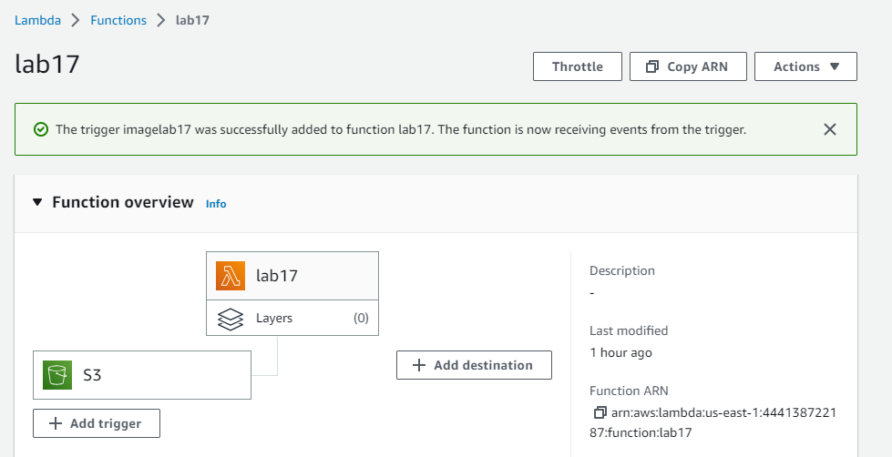
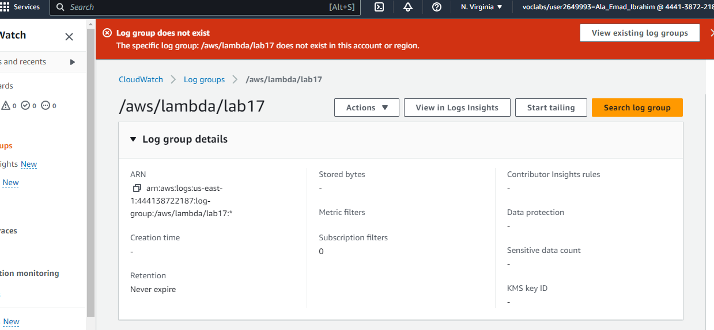

# lab17

## image-lambda

A description of how to use your lambda?

- By pass the required input parameters and invoke the function using an AWS Lambda client.

## lambda Screenshot

## Log group does not exist

## A link to my images

URL: https://imagelab17.s3.amazonaws.com/

